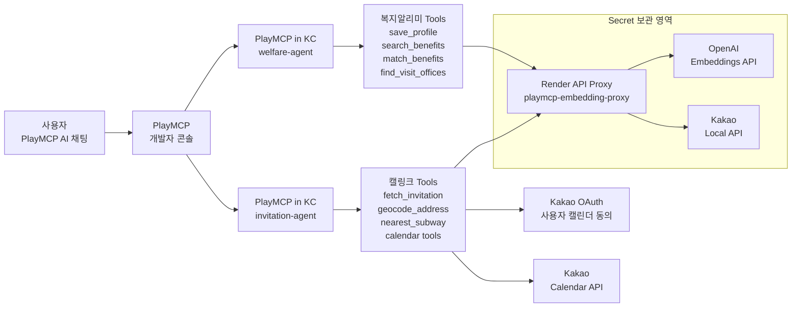
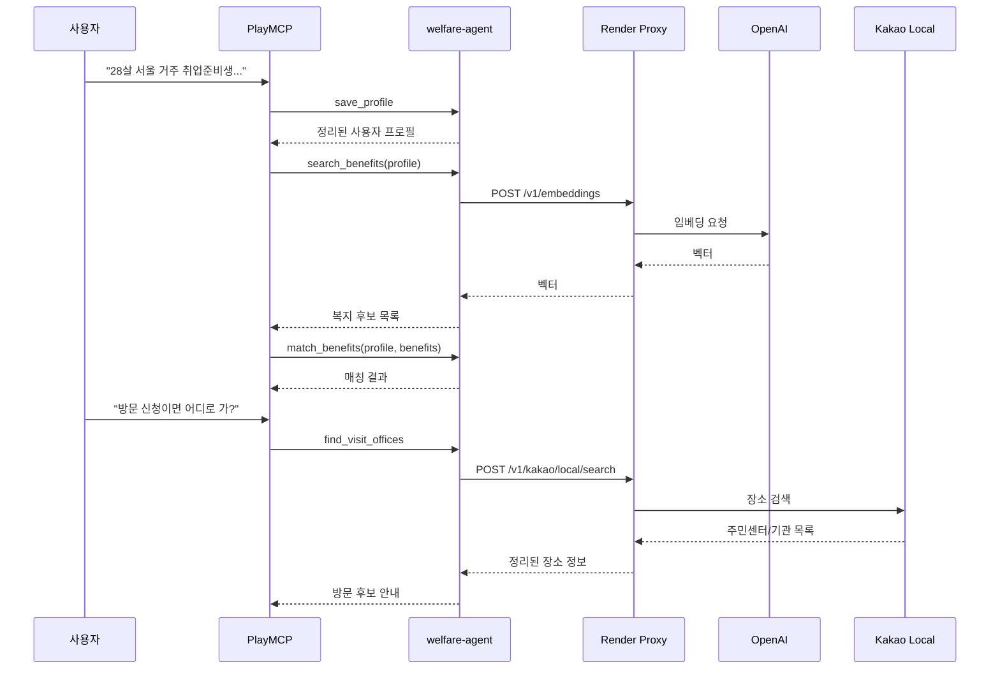
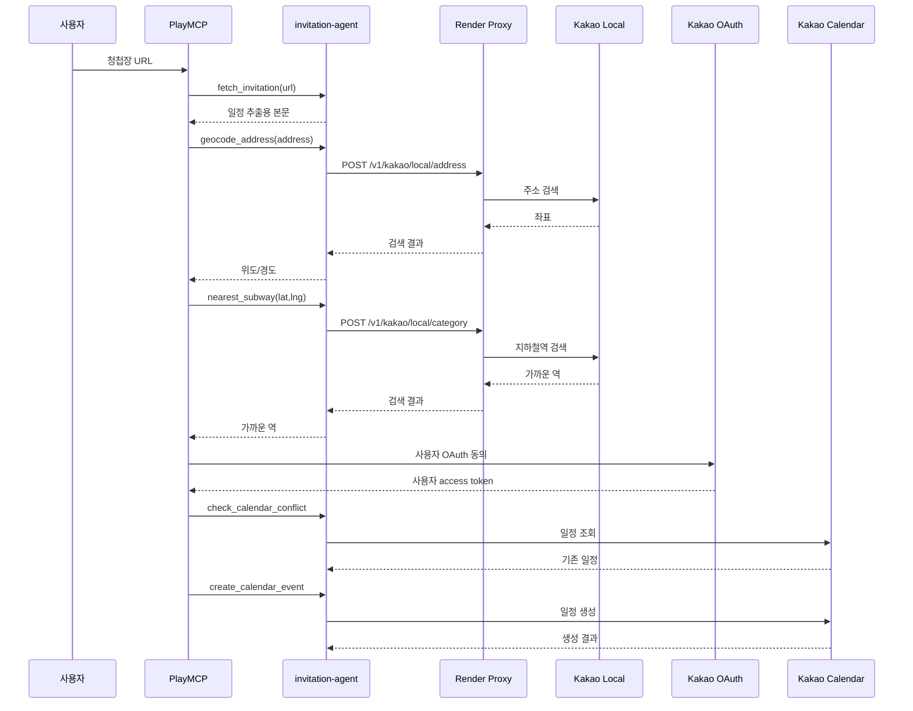

# 서버 구조

이 문서는 두 MCP 서비스와 보조 프록시가 어떻게 연결되는지 정리한다.
개별 서비스 코드는 각 서비스 repo에서 관리하고, 이 repo에서는 배포 방식과 운영 기준만 다룬다.

## 전체 구조

## 구성 요소

| 구성 요소 | 역할 | 비밀값 처리 |
|---|---|---|
| PlayMCP 개발자 콘솔 | MCP 등록, OAuth 설정, AI 채팅 테스트 | OAuth 설정값만 입력 |
| PlayMCP in KC | 각 MCP 서버 실행, HTTPS endpoint 발급 | 런타임 환경변수 입력 제약 있음 |
| welfare-agent | 복지 프로필 생성, 복지 검색/매칭, 방문기관 안내 | API key 직접 보관하지 않음 |
| invitation-agent | 초대장 분석, 주소 좌표 변환, 가까운 역 검색, 캘린더 등록 | Local API key 직접 보관하지 않음. 캘린더는 사용자 OAuth token 필요 |
| Render API Proxy | OpenAI/Kakao Local 호출을 대신 수행 | Render Environment에 secret 저장 |

## 복지알리미 흐름

## 캘링크 흐름

## 주요 endpoint

### PlayMCP in KC

| 서비스 | Endpoint |
|---|---|
| welfare-agent | `https://welfare-agent.playmcp-endpoint.kakaocloud.io/mcp` |
| invitation-agent | `https://invitation-agent.playmcp-endpoint.kakaocloud.io/mcp` |

### Render API Proxy

| 용도 | Endpoint |
|---|---|
| 상태 확인 | `GET /health` |
| OpenAI 임베딩 | `POST /v1/embeddings` |
| Kakao Local 키워드 검색 | `POST /v1/kakao/local/search`, `POST /v1/kakao/local/keyword` |
| Kakao Local 주소 검색 | `POST /v1/kakao/local/address` |
| Kakao Local 카테고리 검색 | `POST /v1/kakao/local/category` |

## 운영 기준

- 공개 MCP endpoint는 PlayMCP in KC에서 발급한 HTTPS URL을 사용한다.
- OpenAI/Kakao API key는 서비스 이미지나 GitHub에 넣지 않는다.
- 외부 API key가 필요한 기능은 Render API Proxy를 거치게 한다.
- MCP 응답은 PlayMCP 응답 크기 제한을 고려해 필요한 필드만 반환한다.
- Kakao Calendar 등록은 사용자별 캘린더 권한이 필요하므로 고정 key가 아니라 OAuth access token으로 처리한다.
- Kakao OAuth 직접 연결이 계속 막히면, 캘링크 책임 범위 안에서 `invitation-agent`에 OAuth adapter를 추가한다.
